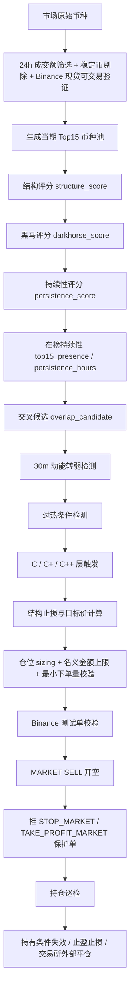

# C 系列策略完整执行路径说明

本文档解释项目里 `C / C+ / C++` 以及相关 `B++ / D++` 持仓拆分逻辑的完整闭环，重点不是字段字典，而是回答下面几个问题：

1. 币种池是怎么来的。
2. `overlap_candidate` 交叉候选池是怎么计算出来的。
3. 为什么不是一进入交叉候选池就直接开空。
4. 30 分钟级别“动能开始转弱”是怎么定义的。
5. `C / C+ / C++` 的触发、开仓、仓位、止损、止盈、平仓分别怎么做。
6. 为什么会出现“模拟盘有单，测试网没有单”。

本文档对应当前项目实现：

- 上游采集与评分：`scripts/top15_collector.py`
- 短空分层信号：`scripts/top15_short_strategy.py`
- 模拟盘：`scripts/top15_paper_trader.py`
- 测试网执行：`scripts/top15_c_strategy_live_trader.py`
- 研究配置：`config/short_strategy.post_confirm_weak_turn_v1.json`
- 测试网配置：`config/binance_c_strategy.testnet.json`

当前测试网配置已切换为：

- `C_overheat_fade_wide_hold`
- 也就是页面里看到的 `C++ / Overheat Hold-Split`

注意：

- 当前配置文件里 `enabled = false`
- 所以这次切换只是把 testnet 默认策略 ID 改成 `C++`
- 不会因为这次改动立即触发实盘下单

## 1. 策略想做什么

`C` 不是“追涨后立刻反手空”的策略，也不是“看到涨幅大就机械做空”的策略。

它的核心假设是：

1. 一个币先在现货热度、交易活跃度、趋势强度、持续在榜时间上形成共振，进入 `overlap_candidate` 交叉候选池。
2. 这说明它已经是当前市场里最强的一批上涨标的之一。
3. 但强势币最危险的空点，不是它刚强起来的时候，而是它“已经过热，且增量动能开始下降”的时刻。
4. 所以 `C` 做的是“强势上涨币的后确认转弱空头”，不是提前猜顶。

一句话概括：

`C` 做的是“已经进入强势交叉候选池的过热币，在 30 分钟级别开始失去上冲动能后的结构性回落”。

---

## 2. 全流程总图



这个流程分成四层理解最清楚：

1. 上游选币层：先决定哪些币有资格进入研究视野。
2. 上游评分层：把“强势上涨”定量化成 `darkhorse + persistence + overlap`。
3. 信号层：判断“强势上涨是否开始衰减”，并按 `C / C+ / C++` 规则触发。
4. 执行层：把信号变成真实仓位，并负责保护单、退出和状态同步。

---

## 3. 第 0 层：币种池是怎么来的

### 3.1 原始来源

上游主源是 `CoinPaprika`，校验源是 `Binance`。

核心筛选规则在代码里写成：

`24h_volume_usd_gt_15m_excluding_stablecoins_binance_spot_only`

它的中文含义是：

1. 先按 24 小时美元成交额筛市场热点。
2. 只保留 `24h volume > 15,000,000 USD` 的币。
3. 剔除稳定币。
4. 必须在 Binance 现货能找到可交易的美元计价交易对。

所以 `C` 的研究对象不是全市场，也不是所有合约币，而是：

“当前 24h 成交活跃、能在 Binance 现货验证、并且位于当期 Top15 的热点币”

### 3.2 为什么要先做 Binance 现货验证

因为策略后面还要做两件事：

1. 用 Binance 现货价格验证第三方价格源是否可靠。
2. 再进一步匹配 Binance 永续合约，看是否能进入测试网执行。

这一步把很多“榜单里很热，但交易所覆盖不足”的币提前排除了。

### 3.3 Top15 是怎么确定的

通过上述规则过滤后，代码会取前 15 个标的作为当期 `top15`。

然后对每个标的继续补充：

1. 现货成交、价格、交易笔数。
2. 永续合约匹配结果。
3. 1h / 4h / 1d K 线结构。
4. 黑马分、持续性分、交叉分。
5. 最近 24 小时在榜持续性。
6. 最近 15m / 30m / 60m 的路径变化。

所以 `Top15` 不是最终交易列表，而只是后续评分体系的输入池。

---

## 4. 第 1 层：上游先把“强势上涨”量化成结构分

在讲 `C` 之前，必须先理解它依赖的上游评分。

### 4.1 `structure_score` 是什么

`structure_score` 可以理解为“这个币当前处在怎样的趋势结构里”。

它综合了三个时间尺度：

- `1d`：日线方向
- `4h`：中短周期方向
- `1h`：近端推进状态

同时考虑两个重要问题：

1. 它是不是在涨。
2. 它涨得是否干净，还是已经剧烈回撤。

### 4.2 结构分的计算逻辑

它主要看这些变量：

- `price_change_7d_pct`：7 天涨跌幅
- `price_change_4h_window_pct`：最近 4 小时涨跌幅
- `price_change_1h_window_pct`：最近 1 小时涨跌幅
- `max_drawdown_7d_pct`：7 天最大回撤
- `breakout_1h`：1 小时是否有突破
- `breakout_4h`：4 小时是否有突破

大体规则如下：

1. 多周期涨幅越强，分数越高。
2. 多周期转跌，分数扣得越多。
3. 回撤浅，说明趋势干净，会加分。
4. 回撤深，说明结构脆弱，会减分。
5. 1h / 4h 有 `VolumeBreakout`（放量突破）或 `PriceBreakout`（价格突破）会加分。

最终把标的划成：

- `TrendLeader`
- `Strong`
- `Neutral`
- `Weak`

这一步的意义不是直接决定开空，而是先判断：

“它到底是不是一只正在被市场持续推进的强势币”

`C` 只会在这种已经强起来的币里找“后确认转弱”的机会。

---

## 5. 第 2 层：`darkhorse_score` 怎么算

### 5.1 这个分数想回答什么

`darkhorse_score` 可以理解为：

“它是不是一只正在快速冲榜、具有黑马属性的热点币”

`darkhorse` 这个英文在这里不是“冷门小币”的意思，而是“正在被市场快速重新定价的强势热门候选”。

### 5.2 输入因子

`darkhorse_score` 不是从零开始，而是先继承 `structure_score`，然后再叠加热点因子。

它主要考虑：

1. `change_24h_pct`：24 小时涨幅
2. `turnover_ratio_24h`：24 小时换手率
3. `activity_bucket`：Binance 现货活跃度
4. `trend_1d / trend_4h`
5. `breakout_1h / breakout_4h`
6. `max_drawdown_7d_pct`
7. 是否是 `Meme`
8. 是否被 Binance 价格强验证

### 5.3 关键计算思想

#### 1. 24h 涨幅越强，黑马属性越强

- `change_24h_pct >= 20` 加 2 分
- `change_24h_pct >= 10` 加 1 分
- 如果 24h 已经转负，直接减分

这说明它更关注“正在爆发”，而不是“已经沉寂”。

#### 2. 换手率要高，但不能高到失真

`turnover_ratio_24h = volume_24h_usd / market_cap_usd`

中文叫“24 小时换手率”，意思是：

“一天之内的成交额，相当于流通市值的多少倍”

它在这里不是越高越好，而是偏好“活跃但没失控”的区间：

- `0.15 <= turnover <= 1.2` 加 2 分
- `turnover > 1.8` 反而扣分

这非常关键。

因为过低的换手说明市场没参与度，过高的换手往往代表情绪冲顶、筹码剧烈交换、后续不稳定。

#### 3. 活跃度用交易笔数和成交额共同判定

`activity_bucket` 来自 Binance 现货的两个量：

- `trade_count`
- `quote_volume`

评分方式是：

- 交易笔数 `>= 1,000,000` 加 2 分
- 交易笔数 `>= 100,000` 加 1 分
- 成交额 `>= 500,000,000` 加 2 分
- 成交额 `>= 50,000,000` 加 1 分

再映射成：

- `Low`
- `Moderate`
- `High`
- `VeryHigh`

`darkhorse_score` 会偏好 `High / VeryHigh`，说明真正有市场参与。

#### 4. 趋势与突破是黑马确认器

如果：

- `trend_1d` 是 `Up / StrongUp`
- `trend_4h` 是 `Up / StrongUp`
- `breakout_1h` 是 `VolumeBreakout / PriceBreakout`
- `breakout_4h` 是 `VolumeBreakout`

都会继续加分。

含义是：

它不是单纯靠 24h 一根大阳线，而是中短周期都在协同推进。

#### 5. 回撤过深会削弱黑马质量

如果 `max_drawdown_7d_pct` 很深，说明虽然涨得猛，但走势不干净，容易出现高波动回撤，所以会扣分。

#### 6. `Meme` 和弱验证会降权

如果：

- `sector_primary == Meme`
- 或 `binance_status != matched`

都会被减分。

这说明策略更偏好“可验证的真实热点”，而不是纯情绪噪音。

### 5.4 darkhorse 分数的本质

它本质上是在回答：

“这只币是不是此刻最像黑马冲榜标的”

但仅有 `darkhorse_score` 还不够，因为很多币会“爆一下就死”，所以还要看持续性。

---

## 6. 第 3 层：`persistence_score` 怎么算

### 6.1 这个分数想回答什么

`persistence_score` 中文可以理解成“持续性分”或“延续性分”。

它关注的不是“爆发得多猛”，而是：

“这种强势能不能维持，不是一闪而过”

### 6.2 核心逻辑

它重点检查：

1. 日线、4h、1h 的上行是否连续。
2. 回撤是否可控。
3. 活跃度是否有承接。
4. 4h / 1h 是否有放量突破。
5. 换手是否健康。
6. 是否已经进入过热区。

### 6.3 计算思想拆解

#### 1. 趋势连续性是主骨架

如果：

- `trend_1d == StrongUp`，加 3 分
- `trend_4h == StrongUp`，加 3 分
- `trend_1h == StrongUp`，加 2 分

如果这些维度转弱，则减分。

所以 `persistence_score` 对多周期同向推进非常敏感。

#### 2. 回撤深度决定“强势是真是假”

如果最大回撤浅：

- 说明强势过程中没有被重锤砸回去
- 会加分

如果回撤深：

- 说明结构稳定性差
- 会明显扣分

#### 3. 高活跃度意味着趋势有人接力

`activity_bucket` 越高，说明上涨不是小流动性自拉自唱，而是真有市场承接。

#### 4. 突破结构会进一步强化持续性

特别是 `4h VolumeBreakout`，这是持续性分里比较重要的加分项。

因为 4h 级别的放量突破，通常比 1h 突破更说明“不是随机噪音”。

#### 5. 过热反而会扣分

如果：

- `turnover_ratio_24h > 2.0`
- 或 `change_24h_pct >= 25`

会扣分。

这说明持续性分的目标不是找“涨得最疯”的，而是找“还能持续推进”的。

### 6.4 persistence 分数的本质

它在回答：

“这只币现在的强势，是不是有延续能力”

如果说 `darkhorse_score` 更像“热度爆发分”，那么 `persistence_score` 更像“持续推进分”。

---

## 7. 第 4 层：`top15_presence` 与 `top15_persistence_hours` 怎么算

仅仅当下强还不够，策略还会看它是不是“持续在榜”。

### 7.1 `top15_persistence_hours`

这个值表示：

“在当前这轮连续快照里，这个币已经连续待在 Top15 里多久了”

计算方式不是简单的 `当前时间 - 首次出现时间`，而是会检查快照连续性：

1. 先估算快照间隔。
2. 从当前快照往前回溯。
3. 只要相邻快照时间差没有明显断层，就继续累计持续时长。
4. 一旦中间断档过大，就认为这一轮持续性结束。

所以它衡量的是“连续在榜时间”，不是“过去 24h 曾经来过几次”。

### 7.2 `top15_presence_ratio_24h`

这个值表示：

“过去 24 小时所有快照里，这个币有多少比例出现在 Top15 里”

公式可以写成：

```text
top15_presence_ratio_24h
= symbol_snapshot_count_24h / total_snapshot_count_24h
```

这是一个“在榜占比”，不是连续性。

### 7.3 为什么这两个量都需要

因为两者解决的是不同问题：

1. `top15_persistence_hours` 看当前这轮是不是在持续发酵。
2. `top15_presence_ratio_24h` 看过去一天是不是反复稳定地占据强势榜。

一个是“连续性”，一个是“稳定性”。

---

## 8. 第 5 层：`overlap_candidate` 交叉候选池怎么计算

这一步是整个 `C` 策略最重要的上游闸门。

### 8.1 什么叫 overlap

`overlap` 的中文含义可以理解为“多维共振重叠”。

它不是一个单独因子，而是要求：

1. 黑马属性强。
2. 持续性强。
3. 在榜时间足够。
4. 中周期趋势没有坏掉。

只有这些条件开始重叠，才会进入 `overlap_candidate`。

### 8.2 第一层：先过 gate

在正式算分之前，先有一层硬闸门 `gate_pass`：

```text
darkhorse_score >= 7
and persistence_score >= 5
and top15_persistence_hours >= 1
and continuation_risk != "High"
and trend_1d not in {"Down", "StrongDown"}
and trend_4h not in {"Down", "StrongDown"}
```

中文翻译：

1. 黑马爆发性必须达标。
2. 持续性必须达标。
3. 至少连续在榜 1 小时。
4. 延续风险不能太高。
5. 1d 和 4h 中周期趋势不能已经转空。

这一步的本质是：

“先确认它真的是强趋势热点，而不是短时噪音”

### 8.3 第二层：再算 overlap 分数

通过 gate 后，再计算 `overlap_score`。

#### 来自黑马分的加权

- `darkhorse_score >= 10` 加 6 分
- `darkhorse_score >= 8` 加 5 分
- `darkhorse_score >= 7` 加 4 分
- `darkhorse_score >= 5` 加 2 分

#### 来自持续性分的加权

- `persistence_score >= 8` 加 6 分
- `persistence_score >= 6` 加 5 分
- `persistence_score >= 5` 加 4 分
- `persistence_score >= 3` 加 2 分

#### 来自在榜连续时长的加权

- `top15_persistence_hours >= 6h` 加 4 分
- `>= 3h` 加 3 分
- `>= 1h` 加 2 分
- `>= 0.5h` 加 1 分

#### 来自在榜占比的加权

- `top15_presence_ratio_24h >= 0.75` 加 2 分
- `>= 0.5` 加 1 分

#### 来自中周期趋势的加分

- `trend_1d in Up / StrongUp` 加 1 分
- `trend_4h in Up / StrongUp` 加 1 分

#### 来自深回撤和高延续风险的扣分

- `max_drawdown_7d_pct <= -25` 扣 2 分
- `<= -18` 扣 1 分
- `continuation_risk == High` 扣 2 分
- `continuation_risk == MediumHigh` 扣 1 分

### 8.4 最终进入交叉候选池的条件

```text
overlap_candidate = gate_pass and overlap_score >= 10
```

所以 `overlap_candidate` 不是“某个字段等于真”那么简单，而是经过两层筛选：

1. 先确认它属于强趋势热点。
2. 再确认这种强势是多维共振。

### 8.5 overlap 的战略意义

这一层决定了 `C` 不会去空普通弱币，也不会去空随机波动币。

它只在“真正强过、热过、并且被系统确认过的币”里找衰减拐点。

这就是为什么 `C` 的上游锚点不是跌势，而是“最强势的一批涨势”。

---

## 9. 为什么不是一进入交叉候选池就开空

因为进入 `overlap_candidate` 只是说明：

“这个币已经是当前热点共振标的”

但这恰恰意味着它可能还在主升浪里。

如果一进入 overlap 就空，问题会很明显：

1. 你在和最强的上涨币逆势对抗。
2. 你空的是“强势确认”，不是“强势衰减”。
3. 这种做法会极大拉高被继续逼空的概率。

所以 `C` 明确要求再等一步：

先强，再热，再弱。

换句话说：

`overlap_candidate` 只是“有资格被观察”，不是“已经允许开仓”。

---

## 10. 第 6 层：30 分钟级别“动能开始转弱”怎么定义

这一步来自 `compute_path_research_features()`，核心是把当前状态和 30 分钟前做比较。

### 10.1 `rank_change_30m`

公式：

```text
rank_change_30m = prev_rank - current_rank
```

注意它的符号含义：

1. 如果当前名次比 30 分钟前更靠前，例如从第 8 名升到第 4 名：
   `8 - 4 = 4`
   这是正数，表示仍在增强。
2. 如果当前名次没改善，或者更差了，例如从第 4 名掉到第 6 名：
   `4 - 6 = -2`
   这是非正数，表示排名动能转弱。

所以：

- `> 0`：榜单排名还在继续改善
- `<= 0`：榜单排名不再改善，甚至开始掉队

### 10.2 `overlap_score_delta_30m`

公式：

```text
overlap_score_delta_30m = current_overlap_score - prev_overlap_score
```

含义：

- `> 0`：交叉共振还在增强
- `<= 0`：交叉共振不再增强，甚至开始回落

### 10.3 `darkhorse_score_delta_30m`

公式：

```text
darkhorse_score_delta_30m = current_darkhorse_score - prev_darkhorse_score
```

它在 `D / D+` 极端过热层里更重要，`C` 主要用前两个量。

### 10.4 `C` 层的通用转弱定义 `generic_weakening`

`C` 并不要求已经明显转跌，只要求“上冲动能不再继续增强”。

触发公式是：

```text
generic_weakening =
    rank_change_30m <= 0
    and overlap_score_delta_30m <= 0
```

中文解释：

1. 排名不再继续往前冲。
2. 交叉共振分也不再继续增加。

这是一种“失速”判定，不是“崩盘”判定。

它抓的是：

“最强阶段已经过去，增量买盘边际下降了”

---

## 11. 第 7 层：C、C+、C++ 的触发条件

### 11.1 过热条件 `c_overheat`

`C` 还要求标的必须先进入“过热区”。

触发公式：

```text
c_overheat =
    change_24h_pct >= 15
    and turnover_ratio_24h >= 0.5
```

中文解释：

1. 24 小时涨幅至少 15%
2. 24 小时换手率至少 0.5

这说明它不是普通上涨，而是：

“涨幅已经很高，资金交换已经很活跃”

### 11.2 C 层最终触发

```text
c_triggered =
    overlap_candidate
    and generic_weakening
    and c_overheat
```

所以 `C` 的完整逻辑不是一句“涨多了做空”，而是：

1. 先是强趋势热点
2. 再是过热
3. 然后 30 分钟动能开始转弱

### 11.3 C 与 C+ 的核心差别

`C` 和 `C+` 的触发条件是一样的。

它们真正的差别只有两个：

1. 可接受的止损窗口不同
2. 止盈倍数不同

#### 标准 C

- 止损窗：`0.8% ~ 4.5%`
- 止盈：`1.0R`

#### C+

- 止损窗：`3.0% ~ 20.0%`
- 止盈：`1.5R`

因此：

- `C` 更像“紧结构、快兑现”
- `C+` 更像“允许更宽结构、换更大空间”

### 11.4 C++ 和 C+ 的核心差别

`C++` 不是新的入场条件，而是新的持仓逻辑。

它和 `C+` 的共同点：

1. 入场前提一样
2. 结构止损窗口一样
3. 目标盈亏结构一样
4. 开仓 sizing 一样

它和 `C+` 的真正区别只有一个：

`C+` 是“入场条件继续兼任持有条件”  
`C++` 是“入场条件”和“持有条件”拆开

也就是：

- `C+` 开仓后，如果当前信号不再满足 `openable`，会退出
- `C++` 开仓后，不再要求继续满足“过热 + overlap + 30m 转弱”这一整套入场前提
- `C++` 只在出现“重新走强”的反向证据时提前退出

### 11.5 当前 testnet 为什么改成 C++

因为 `C++` 更符合这类策略的交易语义：

1. 入场条件只负责决定“第一次在哪里开空”
2. 持有条件只负责决定“开空以后什么时候继续拿、什么时候退出”

如果继续用 `C+` 的老逻辑，会出现一个不合理点：

- 标的进入过热区并转弱后开空
- 之后价格只是正常回落，overlap 分和过热程度自然下降
- 结果系统却把这种“回落正在发生”的状态解释成“信号失效”

这就会导致仓位被过早平掉。

`C++` 修正的就是这个问题。

---

## 12. 第 8 层：结构止损怎么计算

这一层是 `C` 非常重要的风险约束。

### 12.1 为什么不用固定止损

因为不同币种、不同阶段的波动率差异很大。

如果统一用固定百分比止损：

1. 波动大的币会被过早打掉。
2. 波动小的币又可能止损太宽。

所以策略使用的是“结构止损”。

### 12.2 结构止损的输入

它依赖 1 小时 K 线，主要用到：

1. `front_high_price`：入场前 2 小时内的结构前高
2. `ATR`（Average True Range，平均真实波幅）14 周期
3. 1 小时窗口波动区间，作为 ATR 缺失时的代理

配置是：

- `front_high_lookback_h = 2`
- `vol_lookback_h = 1`
- `atr_period = 14`
- `stop_buffer_mult = 0.35`
- `min_buffer_pct = 0.15`

### 12.3 第一步：找结构前高

逻辑：

1. 取入场时刻之前已收盘的 1h K 线。
2. 回看最近 2 小时。
3. 取最高点作为 `front_high_price`。

这个前高代表：

“如果做空后价格重新突破这里，原本的回落假设可能失效”

### 12.4 第二步：估算波动基准

优先使用：

`atr_1h_pct`

如果 ATR 不足，再退化为：

`snapshot_range_1h_pct`

也就是最近 1 小时价格区间占当前价格的百分比。

### 12.5 第三步：给止损加波动缓冲

公式：

```text
stop_buffer_pct = max(min_buffer_pct, vol_base_pct * stop_buffer_mult)
```

中文解释：

1. 波动越大，缓冲越大。
2. 但再小也不低于最小缓冲。

这样做是为了避免止损直接贴在结构前高上，被正常波动扫掉。

### 12.6 第四步：生成止损锚点和止损价

公式：

```text
stop_anchor_price = max(front_high_price, entry_price)
stop_price = stop_anchor_price * (1 + stop_buffer_pct / 100)
stop_pct = (stop_price / entry_price - 1) * 100
```

这里 `stop_anchor_price = max(front_high_price, entry_price)` 的意义是：

1. 如果前高高于入场价，就以前高为锚。
2. 如果前高已经低于入场价，就至少以入场价为锚，再往上留缓冲。

这样可以避免出现“止损价居然比入场价还低”这种无效结构。

### 12.7 第五步：检查止损是否在可交易窗口内

#### 标准 C

```text
0.8% <= stop_pct <= 4.5%
```

#### C+

```text
3.0% <= stop_pct <= 20.0%
```

这一步非常关键。

因为策略不是“只要有信号就空”，而是要求：

“信号成立，而且风险距离在这一层的允许范围内”

也就是说，`C` 信号触发不等于 `C` 可开仓。

真正能开仓的是：

`triggered and stop_tradable`

---

## 13. 第 9 层：止盈目标怎么计算

策略用的是 `R-multiple` 思路。

`R` 的中文可以理解为“每笔交易的风险单位”。

### 13.1 先定义风险绝对值

```text
risk_abs = stop_price - entry_price
```

因为这里是做空：

- 入场在下方
- 止损在上方

所以 `risk_abs` 是“如果止损被打掉，会亏多少钱的价格距离”。

### 13.2 标准 C 的止盈

标准 C 用 `1.0R`：

```text
target_price = entry_price - risk_abs * 1.0
```

也就是赚到和止损等距的利润就止盈。

### 13.3 C+ 的止盈

C+ 用 `1.5R`：

```text
target_price = entry_price - risk_abs * 1.5
```

这意味着：

1. 它允许更宽止损。
2. 同时要求更深回落才止盈。

所以 `C+` 本质上是“允许更大的波动容忍度，换更远的回撤空间”。

---

## 14. 第 10 层：仓位怎么计算

这部分由 live trader 的 `compute_entry_plan()` 负责。

### 14.1 第一原则：先算本笔允许亏多少钱

```text
risk_usd = equity_usd * risk_pct / 100
```

当前测试网配置里：

- `risk_pct = 5`

也就是说，单笔交易理论风险预算是账户权益的 5%。

### 14.2 第二原则：根据止损距离反推最大名义仓位

```text
risk_sized_notional = risk_usd / (stop_pct / 100)
```

这一步的意思是：

如果止损距离越宽，同样的风险预算下，仓位就必须越小。

这正是风险模型的核心。

### 14.3 第三原则：再受账户可用保证金限制

```text
margin_cap_notional_raw = available_balance_usd * leverage
margin_cap_notional = margin_cap_notional_raw * margin_buffer_pct / 100
```

当前测试网配置：

- `leverage = 5`
- `margin_buffer_pct = 95`

意思是：

理论上按 5 倍杠杆能开出的名义仓位，再乘 95%，给自己留一点保证金缓冲。

### 14.4 第四原则：再受全局总敞口限制

```text
gross_cap_usd = equity_usd * max_gross_pct / 100
remaining_gross_usd = gross_cap_usd - open_gross_usd
```

当前测试网配置：

- `max_gross_pct = 500`

也就是总名义仓位不能超过权益的 5 倍。

### 14.5 最终下单名义金额

```text
size_usd = min(
    risk_sized_notional,
    remaining_gross_usd,
    margin_cap_notional
)
```

这三者中最小的那个，才是最终允许的仓位名义金额。

### 14.6 从名义金额转成下单数量

```text
raw_qty = size_usd / market_price
qty = round_qty_down(raw_qty, stepSize)
```

然后还要继续校验：

1. `qty` 是否低于交易所最小下单量
2. `notional_usd` 是否低于交易所最小名义金额
3. `qty` 是否超过交易所 `maxQty`

这一步就是很多“模拟盘能开、测试网不能开”的来源之一。

---

## 15. 第 11 层：live trader 怎么把信号变成真实订单

### 15.1 只会从合约可交易标的里选候选

live trader 并不是直接扫描所有 `Top15`，而是要求：

1. 有 `binance_perp_symbol`
2. 永续状态是 `matched` 或 `matched_partial_error`
3. 符合策略 ID 对应的 `openable`

所以如果某个币在现货热点里很强，但 Binance 测试网没有这个合约，就不可能进入真实执行。

### 15.2 候选排序规则

候选会按下面顺序排序：

1. `quality_score` 高的优先
2. `overlap_score` 高的优先
3. `structure_stop_pct` 更合理的优先

然后再按：

- `max_concurrent`
- `remaining_gross`

控制最多开几笔。

### 15.3 开仓前的实际动作

一笔 `C+` 新单的执行路径是：

1. 如配置允许，先设置该合约杠杆。
2. 用 `test_market_order` 做测试单校验。
3. 通过后发出 `MARKET SELL` 市价开空。
4. 立刻补挂：
   - `STOP_MARKET BUY`
   - `TAKE_PROFIT_MARKET BUY`

也就是说：

开仓和保护单是分两步做的，但开仓成功后会立即补保护。

### 15.4 为什么有重试缩量机制

如果交易所返回：

- `Margin is insufficient`
- `Quantity greater than max quantity`

live trader 不会立刻放弃，而是会缩量重试。

当前配置：

- `entry_retry_shrink_pct = 97`
- `max_entry_retries = 6`

意思是每次把数量缩小到上一次的大约 `97%`，最多重试 6 次。

它解决的是：

1. 保证金略不足
2. 数量略超交易所单笔上限

但如果该币种测试网压根没有这个合约，或者缩量后仍不满足最小规则，还是无法成交。

---

## 16. 第 12 层：持仓后怎么管理

### 16.1 默认退出条件一：保护单触发

如果价格碰到：

- `STOP_MARKET`
- `TAKE_PROFIT_MARKET`

交易所会直接把仓位平掉。

### 16.2 默认退出条件二：`signal_lost`

当前测试网配置里：

`exit_on_signal_loss = true`

这意味着 live trader 每轮都会重新检查当前持仓对应的退出条件。

但对 `C++` 来说，`signal_lost` 的含义已经和旧版 `C+` 不一样。

#### 旧版 `C+` 的理解

如果发现：

```text
not (signal and signal.openable)
```

也就是：

1. 当前这只币已经不再符合 `C+`
2. 或者虽然还在看板里，但已经不满足可开仓条件

系统就会直接市价平仓，理由记为：

`signal_lost`

这本质上等于：

“持仓期间继续要求满足原始入场前提”

#### 现在 `C++` 的理解

`C++` 已经改成持有拆分逻辑。

开仓后，系统不再因为下面这些现象单独退出：

1. `overlap_candidate` 自然回落
2. `overlap_score` 自然下降
3. `change_24h_pct` 或 `turnover_ratio_24h` 回落到过热阈值下方
4. 当前快照里暂时不再能把它算成新的 `openable`

`C++` 提前退出看的不是“还能不能新开仓”，而是“有没有重新走强”。

也就是会看：

1. `rank_change_30m > 0`
2. `overlap_score_delta_30m > 0`
3. 价格重新回到前高附近

满足这些反向证据时，系统才会把仓位判定为持有条件失效，并主动结束。

所以对 `C++` 来说，更准确的理解应该是：

`signal_lost` 在代码层依然是统一退出标签之一，但业务含义已经更接近“hold_lost / strength_resume”

而不是简单的“过热消退了，所以平仓”。

### 16.3 默认退出条件三：交易所状态和本地状态不一致

如果交易所里仓位已经没了，但本地状态还记录成持仓，系统会记：

`trade_flattened_outside_local_state`

这表示：

1. 仓位已经在交易所被平掉
2. 本地账本随后做状态修正

### 16.4 保护单缺失会自动重建

如果系统发现本地记录有仓位，但交易所保护单不完整，会：

1. 先取消残缺保护单
2. 再按当前持仓重建 `stop / take profit`

这一步是为了避免仓位裸奔。

---

## 17. 一个完整的闭环例子

下面用抽象流程描述一笔 `C+` 的完整生命周期。

### 17.1 热点进入榜单

某个币先满足：

1. 24h 成交额足够大
2. Binance 现货可验证
3. 进入当期 Top15

### 17.2 上游评分抬升

随着涨势持续：

1. `structure_score` 因多周期上行而走高
2. `darkhorse_score` 因涨幅、换手、活跃度、突破而走高
3. `persistence_score` 因持续趋势与承接而走高

### 17.3 进入交叉候选池

当满足：

1. `darkhorse_score >= 7`
2. `persistence_score >= 5`
3. `top15_persistence_hours >= 1`
4. 中周期趋势未坏
5. `overlap_score >= 10`

它就进入 `overlap_candidate`

这时系统的观点是：

“这是当前最强的一批热点币之一”

### 17.4 进入过热区

继续上涨后，它达到：

1. `change_24h_pct >= 15`
2. `turnover_ratio_24h >= 0.5`

这时系统的观点变成：

“它不仅强，而且已经热”

### 17.5 30 分钟动能开始失速

随后出现：

1. `rank_change_30m <= 0`
2. `overlap_score_delta_30m <= 0`

这不是说价格已经崩了，而是说：

“最强那段加速期已经过去”

### 17.6 C/C+ 层触发

于是：

```text
overlap_candidate
and c_overheat
and generic_weakening
```

为真。

### 17.7 结构止损决定能不能开

系统根据 1h K 线计算：

1. 前高
2. ATR
3. 缓冲
4. `stop_pct`

如果：

- 对标准 `C` 来说，`stop_pct` 不在 `0.8%~4.5%`
- 对 `C+` 来说，`stop_pct` 不在 `3%~20%`

那么即使信号触发，也不会开仓。

### 17.8 仓位计算

如果止损窗口可交易，再根据：

1. 权益
2. 风险预算
3. 杠杆
4. 可用余额
5. 总敞口上限
6. 交易所最小/最大数量

得到最终下单数量。

### 17.9 实盘执行

测试网通过后：

1. `MARKET SELL`
2. 挂 `STOP_MARKET BUY`
3. 挂 `TAKE_PROFIT_MARKET BUY`

### 17.10 持仓退出

之后持仓可能通过三种路线离场：

1. 到止盈
2. 到止损
3. 持有条件失效，系统主动平仓

这就形成了从“热点发现”到“回落兑现”的完整闭环。

---

## 18. 为什么会出现“C 有单，但测试网没有”

这是用户排查时最关心的问题之一，这里统一总结。

### 18.1 最常见原因一：测试网没有这个合约

例如你已经看到：

`KATUSDT 测试网没有这个币种`

那就会出现：

1. 上游信号存在
2. 模拟盘存在
3. 但测试网无法真实执行

因为 paper trader 只依赖本地信号和价格快照，不依赖测试网是否支持该合约。

而 live trader 必须真的在 Binance Futures Testnet 找到这个市场。

### 18.2 最常见原因二：信号存在，但该层止损窗口不合法

例如：

1. `C` 只接受 `0.8%~4.5%`
2. `C+` 只接受 `3%~20%`

如果结构止损不在该层窗口内：

- 会 `triggered = true`
- 但 `openable = false`

模拟盘和测试网如果不是跑同一层，或者看的不是同一个快照，就会容易产生误解。

### 18.3 最常见原因三：交易所数量规则限制

例如你看到过：

`BadRequestError(-4005, 'Quantity greater than max quantity.')`

这说明：

1. 风险模型算出的仓位是合理的
2. 但交易所单笔数量上限不允许

系统虽然会缩量重试，但并不保证一定能落到合法数量区间。

### 18.4 最常见原因四：保证金不足

例如：

`Margin is insufficient`

这表示：

1. 理论上有信号
2. 但当前可用余额、杠杆、总敞口约束下，交易所不接受这笔单

### 18.5 最常见原因五：前端展示延迟

还有一种情况是：

1. 服务端状态文件已经更新
2. `latest.json` 里已经看到仓位
3. 但前端页面还没刷新出来

这种不是策略逻辑问题，而是展示同步时差。

### 18.6 最本质的结论

“模拟盘有单，测试网没有单”并不自动说明策略有 bug。

它通常来自四类差异：

1. 标的是否在测试网可交易
2. 交易所数量/名义/杠杆规则
3. 保证金与总敞口限制
4. 前端展示刷新时差

---

## 19. C、C+、C++ 的真正策略画像

### 19.1 C

`C` 更像是：

“热点强势币第一次失速后的紧结构回落空头”

特点：

1. 止损窄
2. 风险控制更严格
3. 对结构要求更高
4. 更适合做短促回落

### 19.2 C+

`C+` 更像是：

“同样的过热失速逻辑，但允许更宽的结构波动，用更大的空间去换更深的回落”

特点：

1. 能覆盖更多热点币
2. 能容忍更宽止损
3. 也更容易遇到测试网单笔数量、保证金和名义金额限制

### 19.3 C++

`C++` 更像是：

“沿用 C+ 的宽结构入场，但开仓以后不再拿入场闸门当持有闸门，而只在重新走强时退出”

特点：

1. 入场仍然严格
2. 持仓不因过热自然消退而提前离场
3. 更符合‘做过热回落段’而不是‘做一瞬间信号点’的思路
4. 更适合 testnet 和后续真实执行验证

### 19.4 B++ 与 D++ 的位置

`B++ / D++` 和 `C++` 属于同一类修正思路：

1. `B++` 对应 `B+`
2. `C++` 对应 `C+`
3. `D++` 对应 `D+`

三者共同原则都是：

1. 入场仍沿用原层触发条件
2. 持有阶段不再要求继续满足原层的 entry gating
3. 只有出现重新走强、突破恢复、回到前高等反向证据时才提前退出

---

## 20. 最后用一句话总结 C 系列策略

`C` 的本质不是空弱币，而是空“最强那批币在过热后的第一次确认转弱”。

它的完整闭环是：

1. 先从高成交额、可验证的 Top15 热点里找标的。
2. 用 `structure_score + darkhorse_score + persistence_score + top15_presence` 确认谁是真正的强势热点。
3. 只有进入 `overlap_candidate` 交叉候选池的标的，才有资格被做空观察。
4. 再等待 30 分钟级别的“排名失速 + overlap 分失速”。
5. 还要要求它已经进入高涨幅、高换手的过热区。
6. 最后再用结构止损窗口判断这笔逆势空单的风险是否可承受。
7. 若可承受，再按风险预算、杠杆、保证金、总敞口和交易所规则下单。
8. 持仓后继续巡检；对 `C++` 这类 hold-split 版本，只在重新走强的反向证据出现时主动退出。

如果你把它理解成一句策略语言，就是：

“不是空最弱的，而是空最强那批里，已经热过头并且开始失速的那一个。”
